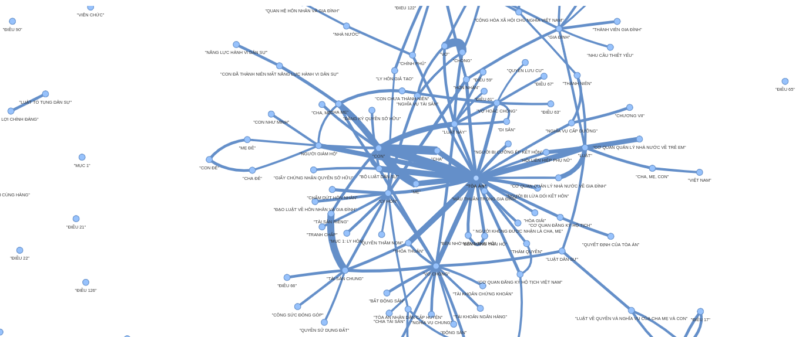

# Legal Question-Answering System for Vietnamese Law

## Overview

This project develops an AI-powered legal question-answering system for Vietnamese law, focusing on marriage and family law. It integrates Large Language Models (LLMs), Retrieval-Augmented Generation (RAG), graph-based retrieval, and web search to deliver accurate, up-to-date legal information.

## Objectives

- Provide accessible legal answers for non-experts.
- Ensure accuracy with sourced, current information.
- Handle complex legal queries effectively.

## Technologies

- **LLMs**: For natural language processing.
- **RAG**: Combines retrieval and generation for precision.
- **Graph Databases (Neo4j)**: Represents legal entities and relationships.
- **Tavily Search**: Fetches real-time web data.
- **NanoDB**: Lightweight storage for text data.

## Dataset

- **Sources**: Legal websites (Thư Viện Pháp Luật, LuatVietnam), Marriage and Family Law 2014, legal books.
- **Stats**:
  - 2,772 document chunks
  - 2,738,108 tokens
  - 1,949,688 words
  - 14,289 entities (nodes)
  - 15,774 relationships (edges)
 

## Evaluation

- **Test Set**: 75 exam questions, 125 generated questions.
- **Criteria**: Comprehensiveness, diversity, empowerment, directness.
- **Results**: GraphRAG excels on complex queries (~60% win rate vs. naïve RAG), both average ~8/10 on simpler ones.
